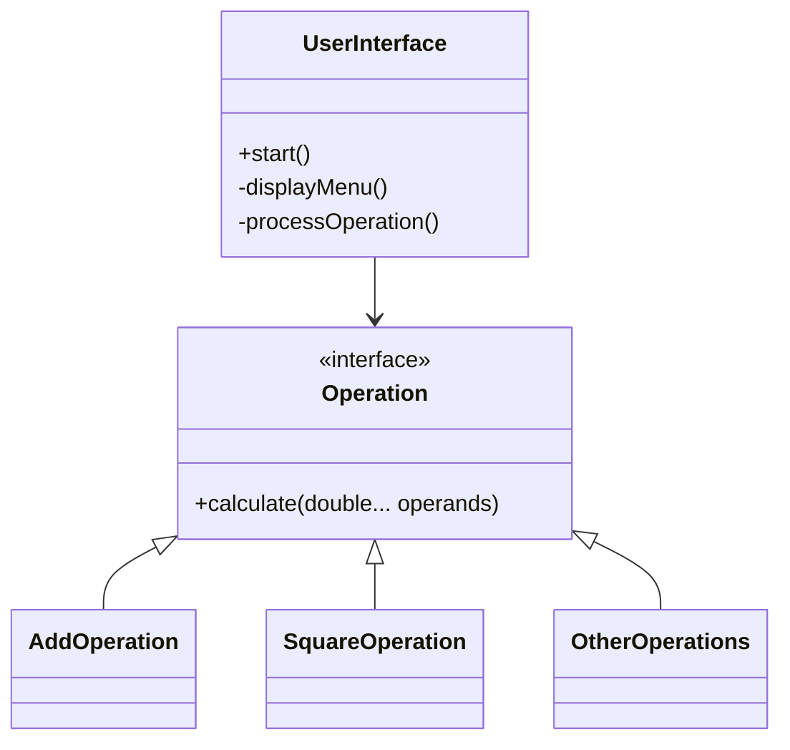

# 📊 ExceptionSafe Java Calculator

**A robust, object-oriented calculator application with exception handling and modular design**


## 🚀 Features

### 🧮 Core Operations
| Operation        | Class               | Type   | Exception Handling                 |
|------------------|---------------------|--------|------------------------------------|
| Addition         | `AddOperation`      | Binary | `IllegalArgumentException`        |
| Subtraction      | `SubtractOperation` | Binary | `IllegalArgumentException`        |
| Multiplication   | `MultiplyOperation` | Binary | `IllegalArgumentException`        |
| Division         | `DivideOperation`   | Binary | `ArithmeticException` (div by 0)  |
| Square           | `SquareOperation`   | Unary  | `IllegalArgumentException`        |
| Cube             | `CubeOperation`     | Unary  | `IllegalArgumentException`        |
| Square Root      | `SquareRootOperation`| Unary | `IllegalArgumentException` (negative input) |

### 🛡️ Error Handling
- **Input Validation**
  - Checks for numeric inputs
  - Validates operand counts (1 for unary, 2 for binary)
- **Math Safety**
  - Division by zero protection
  - Negative square root prevention

### 🧩 Architecture


## 🛠️ Installation
```bash
# Clone repository
git clone https://github.com/yourusername/repo-name.git

# Compile (from src folder)
javac -d . Main.java UserInterface.java operations/*.java

# Run
java Main
```

## 📝 Code Documentation
### Key Classes

**`UserInterface.java`**
```java
/**
 * Handles all user interactions
 * Implements menu-driven console interface
 */
public class UserInterface {
    // Scanner for user input
    private Scanner scanner;  
    
    // Main interface loop
    public void start() { /* ... */ }
}
```

**`Operation.java` (Interface)**
```java
/**
 * Contract for all mathematical operations
 * Uses varargs for flexible operand handling
 */
public interface Operation {
    double calculate(double... operands) 
        throws IllegalArgumentException, ArithmeticException;
}
```

## 🌟 Why This Calculator?
- **Clean Architecture**: Separation of UI and business logic
- **Extensible**: Add new operations without modifying existing code
- **Production-Ready**: Comprehensive exception handling
- **Documented**: Complete Javadoc comments

## 📜 Commit History
```bash
1. Initial commit - Basic structure
2. feat: Add core operations interface
3. feat: Implement binary operations
4. feat: Add unary operations
5. docs: Complete code comments
6. chore: Add README documentation
```


